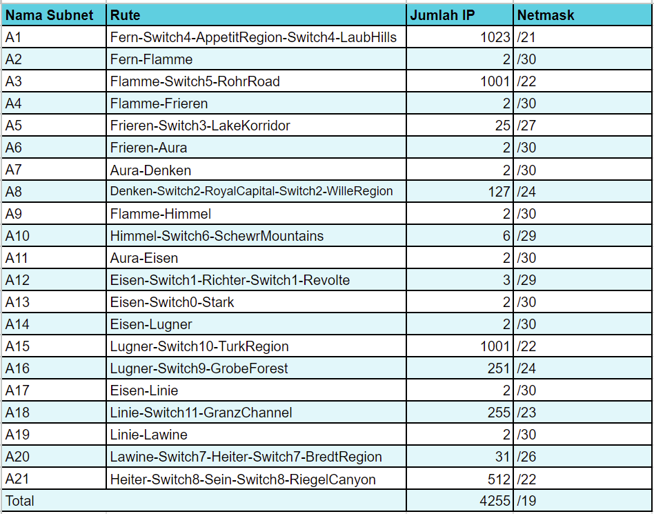
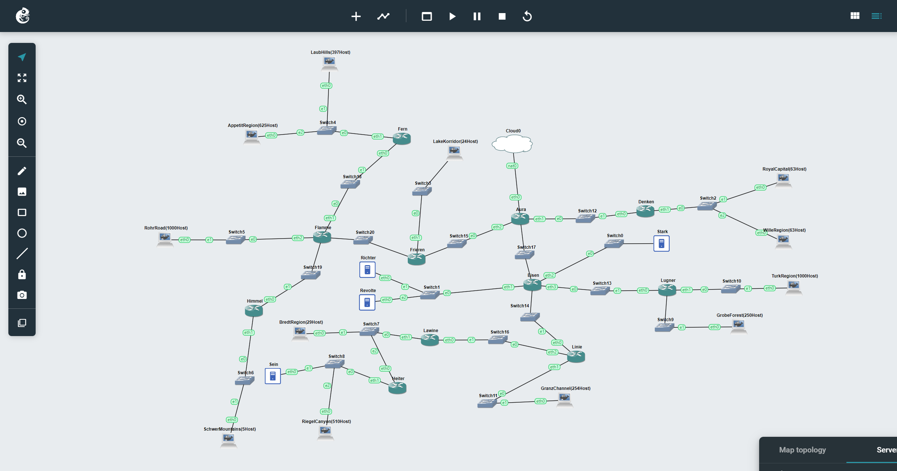
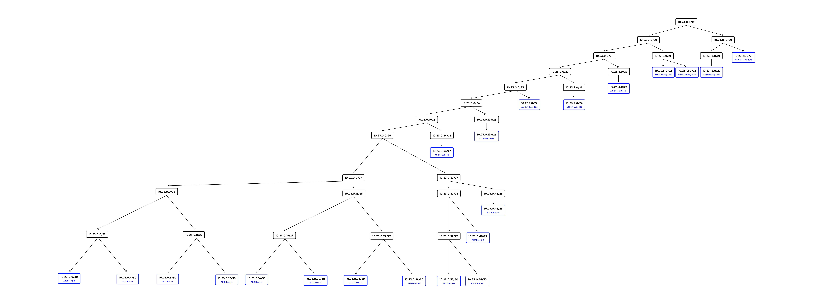
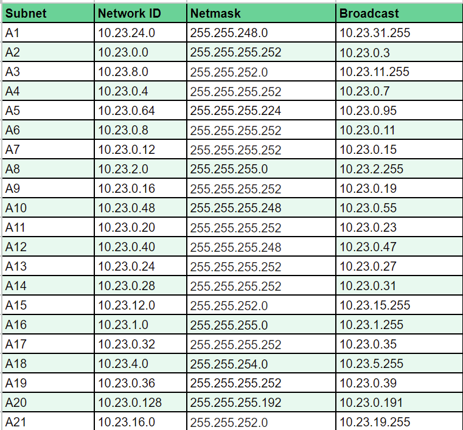

# Praktikum Modul 4 Jaringan Komputer

Perkenalkan kami dari kelas `Jaringan Komputer D Kelompok D03`, dengan anggota sebagai berikut:

| Nama                   | NRP        |
| ---------------------- | ---------- |
| Alfan Lukeyan Rizki    | 5025211046 |
| Dimas Prihady Setyawan | 5025211184 |

# Laporan Resmi Praktikum Modul 4
Pada kesempatan kali ini kami akan membahas mengenai soal praktikum modul 4. Soal praktikum modul 4 memuat konsep mengenai
- `VLSM` menggunakan `GNS 3`
- `CIDR` menggunakan `Cisco Packet Tracer`

## Daftar Isi
- [Official Report](#laporan-resmi)
- [Menu](#daftar-isi)
    - [Prefix IP](#prefix-ip)
    - [Rute](#rute)
- [VLSM](#vlsm)
    - [Penjelasan VLSM](#penjelasan-vlsm)
    - [Topologi GNS VLSM](#topologi-gns-vlsm)
    - [Tree](#tree)
    - [Pembagian IP](#pembagian-ip)
    - [Konfigurasi Network](#konfigurasi-network)
    - [Routing](#routing)
    - [Testing](#testing)
- [CIDR](#cidr)
  - [Topologi PKT CIDR](#topologi-pkt-cidr)

### Prefix IP
Prefix IP yang dimiliki oleh kelompok D03 adalah `10.23.x.x`

### Rute
Berikut adalah pembagian subnet dan rute yang digunakan oleh kelompok D03


## VLSM

### Penjelasan VLSM
Variable Length Subnet Masking (VLSM), juga dikenal sebagai teknik subnetting, digunakan untuk mengoptimalkan alokasi alamat IP di dalam jaringan. Metode ini memungkinkan penyesuaian ukuran netmask sesuai dengan jumlah komputer atau host yang diperlukan dalam suatu subnet tanpa terikat pada batasan seragam. Administrasi jaringan menjadi lebih fleksibel dengan VLSM, memungkinkan optimalisasi penggunaan alamat IP dan menghindari pemborosan sumber daya.

Proses implementasi VLSM melibatkan pembagian suatu jaringan besar menjadi subnet-subnet yang berukuran beragam, di mana masing-masing diberikan netmask sesuai dengan kebutuhan jumlah host. Subnet dengan lebih banyak host akan memiliki netmask dengan jumlah bit yang lebih sedikit, sedangkan subnet dengan kebutuhan host yang lebih sedikit akan memiliki netmask dengan jumlah bit yang lebih banyak.

Keunggulan utama VLSM terletak pada efisiensi penggunaan alamat IP, memungkinkan penghindaran alokasi subnet berukuran besar untuk jaringan kecil yang membutuhkan alamat IP dalam jumlah terbatas. Selain itu, VLSM juga berperan dalam mengurangi konsumsi alamat IP secara keseluruhan di dalam jaringan, mendukung pertumbuhan dan perluasan jaringan dengan lebih efektif.

### Topologi GNS VLSM


### Tree
Berikut adalah tree pembagian IP pada tiap-tiap subnet. 



### Pembagian IP
Berikut ini adalah output dari pembagian alamat IP yang kami dapatkan setelah melakukan subdivisi dari hasil pemecahan sebelumnya menjadi jaringan yang lebih kecil.



### Konfigurasi Network

- LaubHills - Client(397 Hosts)
```sh
# A1/21
auto eth0
iface eth0 inet static
    address 10.23.24.2
    netmask 255.255.248.0
    gateway 10.23.24.1
```
- AppetitRegion - Client (625 Hosts)
```sh
# A1/21
auto eth0
iface eth0 inet static
    address 10.23.24.3
    netmask 255.255.248.0
    gateway 10.23.24.1
```
- Fern - Router
```sh
#Fern
# A2/30 Fern-Flamme
auto eth0
iface eth0 inet static
    address 10.23.0.2
    netmask 255.255.255.252
    gateway 10.23.0.1

# A1/21 Fern-LaubHills-AppetitRegion
auto eth1
iface eth1 inet static
	address 10.23.24.1
	netmask 255.255.248.0
```
- Flamme - Router
```sh
# Flamme
# A4/30 Flamme-Frieren
auto eth0
iface eth0 inet static
    address 10.23.0.6
    netmask 255.255.255.252
    gateway 10.23.0.5

# A2/30 Flamme-Fern
auto eth1
iface eth1 inet static
    address 10.23.0.1
    netmask 255.255.255.252

# A3/22 Flamme-RohrRoad
auto eth2
iface eth2 inet static
    address 10.23.8.1
    netmask 255.255.252.0

# A9/30 Flamme-Himmel
auto eth3
iface eth3 inet static
    address 10.23.0.17
    netmask 255.255.255.252
```
- RohrRoad - Client (1000 Hosts)
```sh
# A3/22
auto eth0
iface eth0 inet static
    address 10.23.8.2
    netmask 255.255.252.0
    gateway 10.23.8.1
```
- Himmel - Router
```sh
# Himmel
# A9/30 Himmel-Flamme
auto eth0
iface eth0 inet static
    address 10.23.0.18
    netmask 255.255.255.252
    gateway 10.23.0.17

# A10/29 Himmel-SchwerMountains
auto eth1
iface eth1 inet static
    address 10.23.0.49
    netmask 255.255.255.248
```
- SchwerMountains (5 Hosts)
```sh
#A10/29
auto eth0
iface eth0 inet static
    address 10.23.0.50
    netmask 255.255.255.248
    gateway 10.23.0.49
```
- Frieren - Router
```sh
# Frieren
# A6/30 Frieren-Aura
auto eth0
iface eth0 inet static
    address 10.23.0.10
    netmask 255.255.255.252
    gateway 10.23.0.9

# A5/27 Frieren-LakeKorridor
auto eth1
iface eth1 inet static
    address 10.23.0.65
    netmask 255.255.255.224

# A4/30 Frieren-Flamme
auto eth2
iface eth2 inet static
    address 10.23.0.5
    netmask 255.255.255.252
```
- LakeKorridor - (24 Hosts)
```sh
#A5/27
auto eth0
iface eth0 inet static
    address 10.23.0.66
    netmask 255.255.255.224
    gateway 10.23.0.65
```
- Aura - Router
```sh
#Aura
auto eth0
iface eth0 inet dhcp

# A6/30 Aura-Frieren
auto eth2
iface eth2 inet static
	address 10.23.0.9
	netmask 255.255.255.252

#A7/30 Aura-Denken
auto eth1
iface eth1 inet static
	address 10.23.0.13
	netmask 255.255.255.252

# A11/30 Aura-Eisen
auto eth3
iface eth3 inet static
    address 10.23.0.21
    netmask 255.255.255.252
```
- Denken - Router
```sh
# Denken
# A7/30 Denken-Aura
auto eth0
iface eth0 inet static
    address 10.23.0.14
    netmask 255.255.255.252
    gateway 10.23.0.13

# A8/24 Denken-RoyalCapital-WilleRegion
auto eth1
iface eth1 inet static
    address 10.23.2.1
    netmask 255.255.255.0
```
- RoyalCapital (63 Hosts)
```sh
# A8/24
auto eth0
iface eth0 inet static
    address 10.23.2.2
    netmask 255.255.255.0
    gateway 10.23.2.1
```
- WilleRegion (63 Hosts)
```sh
# A8/24
auto eth0
iface eth0 inet static
    address 10.23.2.3
    netmask 255.255.255.0
    gateway 10.23.2.1
```
- Eisen - Router
```sh
# Eisen
# A11/30 Eisen-Aura
auto eth0
iface eth0 inet static
    address 10.23.0.22
    netmask 255.255.255.252
    gateway 10.23.0.21

# A12/29 Eisen-Richter-Revolte
auto eth1
iface eth1 inet static
    address 10.23.0.41
    netmask 255.255.255.248

# A13/30 Eisen-Stark
auto eth2
iface eth2 inet static
    address 10.23.0.25
    netmask 255.255.255.252

# A14/30 Eisen-Lugner
auto eth3
iface eth3 inet static
    address 10.23.0.29
    netmask 255.255.255.252

# A17/30 Eisen-Linie
auto eth4
iface eth4 inet static
    address 10.23.0.33
    netmask 255.255.255.252
```
- Richter - Server
```sh
# A12/29
auto eth0
iface eth0 inet static
    address 10.23.0.42
    netmask 255.255.255.248
    gateway 10.23.0.41
```
- Revolte - Server
```sh
# A12/29
auto eth0
iface eth0 inet static
    address 10.23.0.43
    netmask 255.255.255.248
    gateway 10.23.0.41
```
- Stark - Server
```sh
# A13/30
auto eth0
iface eth0 inet static
    address 10.23.0.26
    netmask 255.255.255.252
    gateway 10.23.0.25
```
- Lugner - Router
```sh
# Lugner
# A14/30 Lugner-Eisen
auto eth0
iface eth0 inet static
    address 10.23.0.30
    netmask 255.255.255.252
    gateway 10.23.0.29

# A15/22 Lugner-TurkRegion
auto eth1
iface eth1 inet static
    address 10.23.12.1
    netmask 255.255.252.0

# A16/24 Lugner-GrobeForest
auto eth2
iface eth2 inet static
    address 10.23.1.1
    netmask 255.255.255.0
```
- TurkRegion (1000 Hosts)
```sh
# A15/22
auto eth0
iface eth0 inet static
    address 10.23.12.2
    netmask 255.255.252.0
    gateway 10.23.12.1
```
- GrobeForest (250 Hosts)
```sh
# A16/24
auto eth0
iface eth0 inet static
    address 10.23.1.2
    netmask 255.255.255.0
    gateway 10.23.1.1
```
- Linie - Router
```sh
# Linie
# A17/30 Linie-Eisen
auto eth0
iface eth0 inet static
    address 10.23.0.34
    netmask 255.255.255.252
    gateway 10.23.0.33

# A18/23 Linie-GranzChannel
auto eth1
iface eth1 inet static
    address 10.23.4.1
    netmask 255.255.254.0

# A19/30 Linie-Lawine
auto eth2
iface eth2 inet static
    address 10.23.0.37
    netmask 255.255.255.252
```
- GranzChannel (254 Hosts)
```sh
#A18/23
auto eth0
iface eth0 inet static
    address 10.23.4.2
    netmask 255.255.254.0
    gateway 10.23.4.1
```
- Lawine - Router
```sh
# Lawine
# A19/30 Lawine-Linie
auto eth0
iface eth0 inet static
    address 10.23.0.38
    netmask 255.255.255.252
    gateway 10.23.0.37

# A20/26 Lawine-BredtRegion-Heiter
auto eth1
iface eth1 inet static
    address 10.23.0.129
    netmask 255.255.255.192
```
- BredtRegion (29 Hosts)
```sh
#A20/26
auto eth0
iface eth0 inet static
    address 10.23.0.131
    netmask 255.255.255.192
    gateway 10.23.0.129
```
- Heiter - Router
```sh
# Heiter
# A20/26 Heiter-Lawine
auto eth0
iface eth0 inet static
    address 10.23.0.130
    netmask 255.255.255.192
    gateway 10.23.0.129

# A21/22 Heiter-Sein-RiegelCanyon
auto eth1
iface eth1 inet static
    address 10.23.16.1
    netmask 255.255.252.0
```
- Sein - Server
```sh
#A21/22
auto eth0
iface eth0 inet static
    address 10.23.16.2
    netmask 255.255.252.0
    gateway 10.23.16.1
```
- RiegelCanyon (510 Hosts)
```sh
# A21/22
auto eth0
iface eth0 inet static
    address 10.23.16.3
    netmask 255.255.252.0
    gateway 10.23.16.1
```

### Routing

- Fern
```sh
route add -net 0.0.0.0 netmask 0.0.0.0 gw 10.23.0.1
```
- Flamme
```sh
route add -net 10.23.24.0 netmask 255.255.248.0 gw 10.23.0.2
# route add -net 0.0.0.0 netmask 0.0.0.0 gw 10.23.0.5
route add -net 10.23.0.48 netmask 255.255.255.248 gw 10.23.0.18
```
- Himmel
```sh
route add -net 0.0.0.0 netmask 0.0.0.0 gw 10.23.0.17
```
- Frieren
```sh
route add -net 10.23.24.0 netmask 255.255.248.0 gw 10.23.0.6
route add -net 10.23.8.0 netmask 255.255.252.0 gw 10.23.0.6
route add -net 10.23.0.48 netmask 255.255.255.248 gw 10.23.0.6
# route add -net 0.0.0.0 netmask 0.0.0.0 gw 10.23.0.9
route add -net 10.23.0.0 netmask 255.255.255.252 gw 10.23.0.6
route add -net 10.23.0.16 netmask 255.255.255.252 gw 10.23.0.6
# route add -net 10.23.0.4 netmask 255.255.255.252 gw 10.23.0.6
```
- Aura
```sh
route add -net 10.23.2.0 netmask 255.255.255.0 gw 10.23.0.14
route add -net 10.23.24.0 netmask 255.255.248.0 gw 10.23.0.10
route add -net 10.23.0.0 netmask 255.255.255.252 gw 10.23.0.10
route add -net 10.23.0.16 netmask 255.255.255.252 gw 10.23.0.10
route add -net 10.23.0.4 netmask 255.255.255.252 gw 10.23.0.10
route add -net 10.23.0.24 netmask 255.255.255.252 gw 10.23.0.22
route add -net 10.23.0.40 netmask 255.255.255.248 gw 10.23.0.22
route add -net 10.23.0.64 netmask 255.255.255.224 gw 10.23.0.10
route add -net 10.23.0.28 netmask 255.255.255.252 gw 10.23.0.22
route add -net 10.23.12.0 netmask 255.255.252.0 gw 10.23.0.22
route add -net 10.23.1.0 netmask 255.255.255.0 gw 10.23.0.22
route add -net 10.23.0.32 netmask 255.255.255.252 gw 10.23.0.22
route add -net 10.23.4.0 netmask 255.255.254.0 gw 10.23.0.22
route add -net 10.23.0.36 netmask 255.255.255.252 gw 10.23.0.22
route add -net 10.23.0.128 netmask 255.255.255.192 gw 10.23.0.22
route add -net 10.23.16.0 netmask 255.255.252.0 gw 10.23.0.22
route add -net 10.23.0.48 netmask 255.255.255.248 gw 10.23.0.10
route add -net 10.23.8.0 netmask 255.255.252.0 gw 10.23.0.10
```
- Denken
```sh
route add -net 0.0.0.0 netmask 0.0.0.0 gw 10.23.0.13
```
- Eisen
```sh
# route add -net 0.0.0.0 netmask 0.0.0.0 gw 10.23.0.21
route add -net 10.23.12.0 netmask 255.255.252.0 gw 10.23.0.30
route add -net 10.23.1.0 netmask 255.255.255.0 gw 10.23.0.30
route add -net 10.23.4.0 netmask 255.255.254.0 gw 10.23.0.34
route add -net 10.23.0.36 netmask 255.255.255.252 gw 10.23.0.34
route add -net 10.23.0.128 netmask 255.255.255.192 gw 10.23.0.34
route add -net 10.23.16.0 netmask 255.255.252.0 gw 10.23.0.34
```
- Lugner
```sh
route add -net 0.0.0.0 netmask 0.0.0.0 gw 10.23.0.29
```
- Linie
```sh
#route add -net 0.0.0.0 netmask 0.0.0.0 gw 10.23.0.33
route add -net 10.23.0.128 netmask 255.255.255.192 gw 10.23.0.38
route add -net 10.23.16.0 netmask 255.255.255.192 gw 10.23.0.38
```
- Lawine
```sh
#route add -net 0.0.0.0 netmask 0.0.0.0 gw 10.23.0.37
route add -net 10.23.16.0 netmask 255.255.252.0 gw 10.23.0.130
```
- Heiter
```sh
route add -net 0.0.0.0 netmask 0.0.0.0 gw 10.23.0.129
```